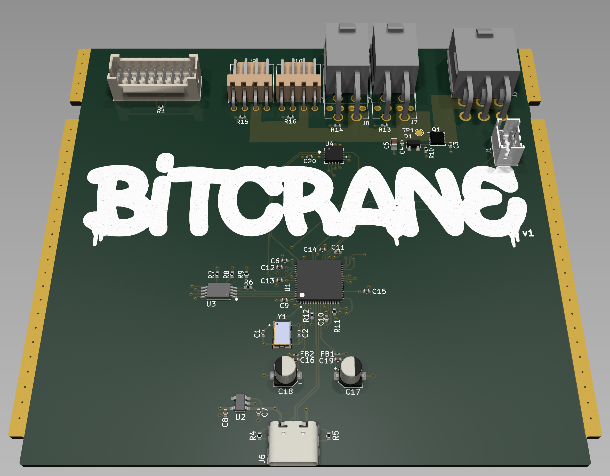

# bitcrane

introducing the bitcrane. a quick tool to spit bytes at an Antminer hashboard over USB (and control fans & PSU).

uses the [FTDI FT4232HQ](https://ftdichip.com/products/ft4232hq/)

[DigiKey Parts List v1](https://www.digikey.com/en/mylists/list/JUGWIN7J9W)
